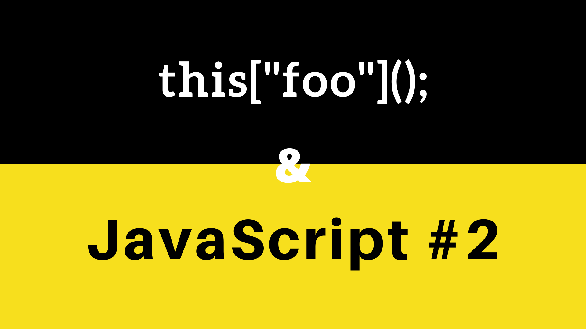

# Appel de fonction dynamiquement nommée

## Comment appeler une fonction avec un nom dynamique ? 
Il est possible d'appeler une fonction en passant le nom de la fonction dans un tableau contenant une string faisant référence au nom de la fonction.

```javascript 
class Example {

    constructor(functionName) {
        this[functionName]();
    }

    foo() {
        console.log("bar");
    }
}

let example = new Example("foo");
// -> bar
```


## Mais alors, comment est-ce que ça fonctionne ?

Prenons un objet "simple" : 

```javascript 
let cat = {
    name: "Felix",
    sayMiaou: function () {
        console.log('Miaaouu');
    }
}
```

Si nous faisons un print de cet objet : `console.log(cat)` 
nous obtenons : `{ name: 'Felix', sayMiaou: [Function: sayMiaou] }`.

Rappelons nous comment accèder aux propriétés d'un objet.

*"Les objets peuvent être vus comme des tableaux associatifs (map, dictionnaires, table de hachage, annuaire, etc.). Les clés (keys) de ce tableau sont les noms des propriétés de l'objet. Lorsqu'on parle d'objets, on fait généralement une distinction entre les propriétés et les méthodes. En réalité cette différence est plus dûe à une convention qu'à une réelle distinction. En effet, une méthode est simplement une propriété qu'on peut appeler (sa valeur fera souvent référence à une instance de Function)."* -- Developer Mozilla

Il est existe notamment deux façons d'accèder aux propriétes de l'objet :
- `cat.name` ou `cat["name"]`. 
- De la même manière ; `cat.sayMiaou()` ou **`cat["sayMiaou"]()`**.

C'est donc de la manière d'accèder aux propriétes de l'objet que nous pouvons appeler des fonctions dynamiquement.


## Ressources :
- https://developer.mozilla.org/fr/docs/Web/JavaScript/Reference/Op%C3%A9rateurs/Op%C3%A9rateurs_de_membres